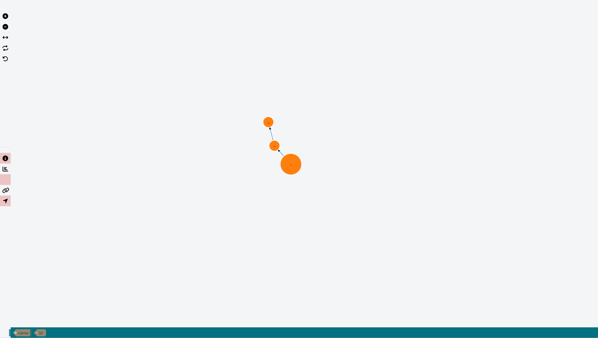

# -quality_miao-knowledgegraph
Draw a knowledge graph



**使用方法请参考 test.html**
- `npm install @quality_miao/knowledgegraph`
- If you want use dict_data to load knowledge graph, set use_dict true 
- Based on neo4j, set your own requestUrl & json parameters to init page.(set post_request:true, post_url:"/t/t", post_parameters:"json")
- data structure just like: `{"nodes":[{"name":"author","id":1},{"name":"software","id":2},{"name":"application","id":3}],"links":[{"source":1,"target":2,"label":"write"},{"source":2,"target":3,"label":"apply"}]}`,

```json
{
    tip_use: false,
    use_dict: true,
    dict_data: {"nodes":[{"name":"author","id":1},{"name":"software","id":2},{"name":"application","id":3}],"links":[{"source":1,"target":2,"label":"write"},{"source":2,"target":3,"label":"apply"}]},
    post_request:false,
    post_url:"",
    post_parameters:{}
}
```
